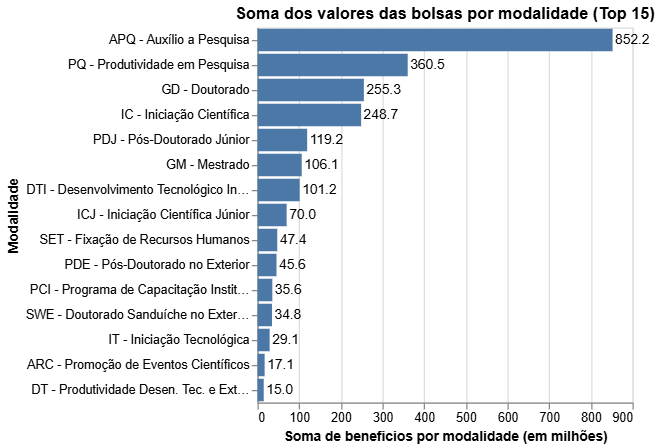
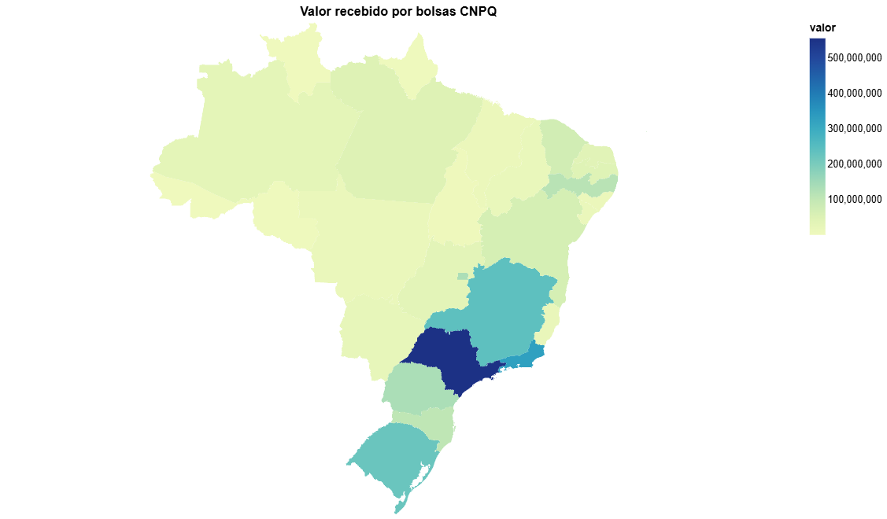
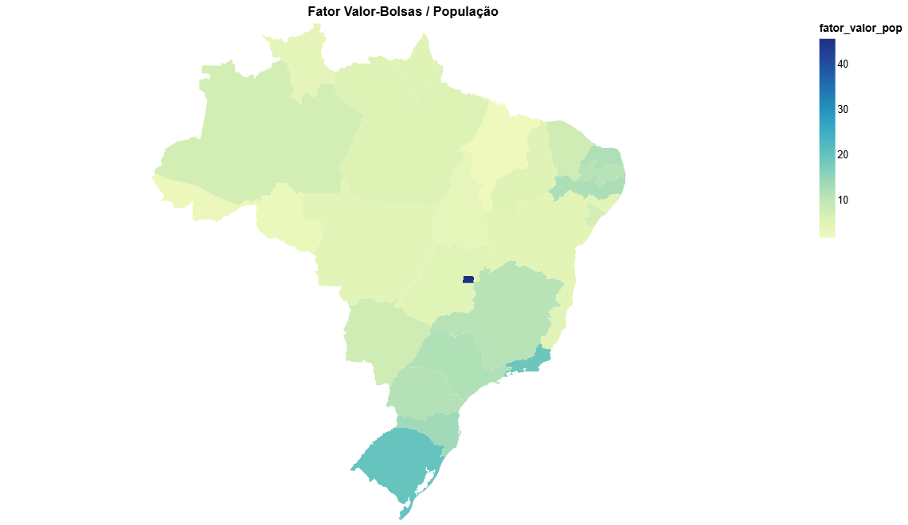
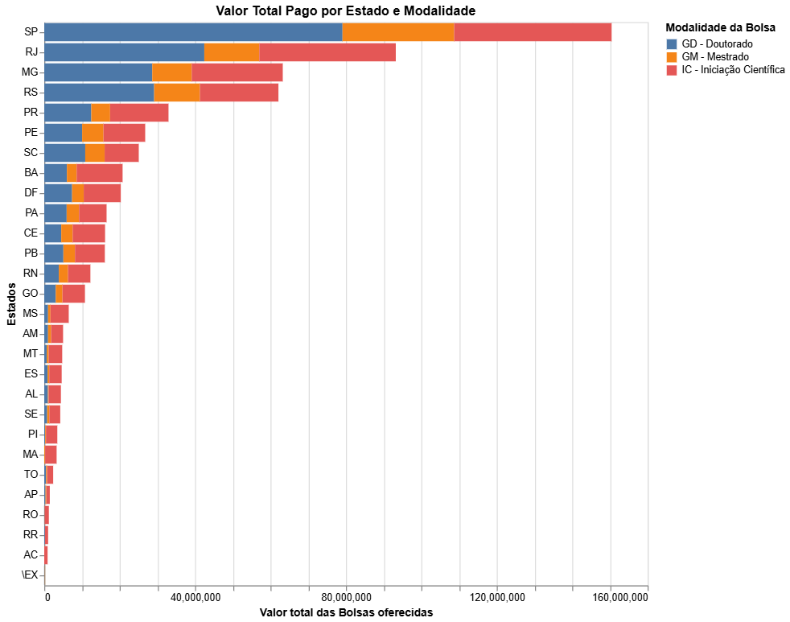
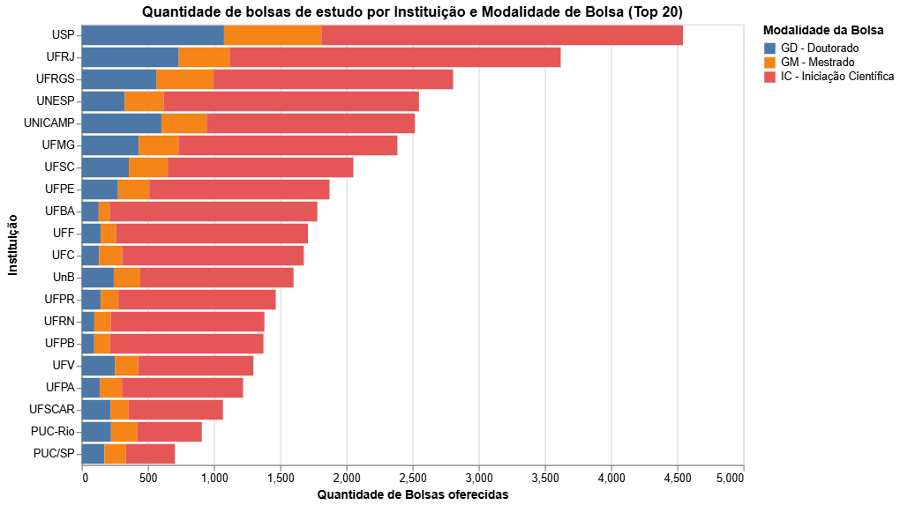
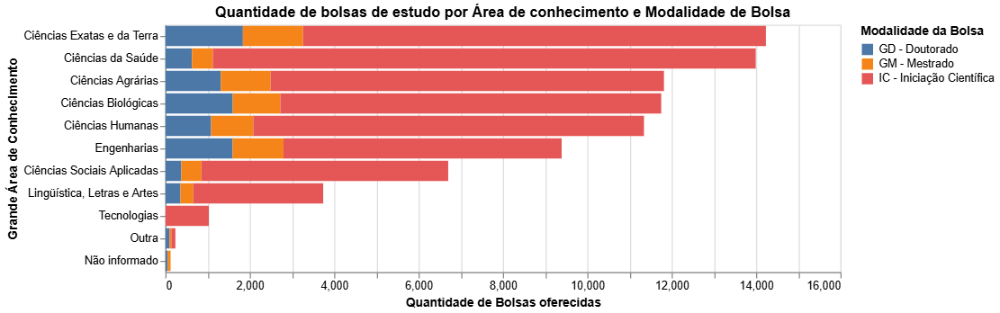

# CNPQ-Bolsas

O Conselho Nacional de Desenvolvimento Científico e Tecnológico (CNPq) é uma agência governamental brasileira responsável por promover o avanço científico e tecnológico do país, através do fomento à pesquisa e à formação de recursos humanos.

A importância do CNPq se dá pelo fato de que a pesquisa científica e tecnológica é um dos pilares fundamentais para o desenvolvimento social, econômico e cultural de um país. Através do incentivo e suporte a pesquisadores e instituições de pesquisa, o CNPq contribui para o avanço do conhecimento científico e tecnológico no país, com impactos positivos em diversas áreas, como saúde, meio ambiente, agricultura, energia, entre outras.

Conhecer a distribuição de recursos do CNPq é importante para avaliar a forma como a instituição está investindo em pesquisa e formação de recursos humanos no país. Isso permite identificar as áreas do conhecimento que estão recebendo mais ou menos recursos, bem como as regiões e instituições que estão sendo beneficiadas. A partir dessas informações, é possível identificar oportunidades e desafios para o desenvolvimento da pesquisa e propor ações que possam contribuir para o fortalecimento dessas áreas em diferentes regiões e segmentos da sociedade.

A seguir, temos o valor gasto pela CNPQ pela Modalidade da Bolsa, indicando que a maior parte dos recursos é gasto em auxílio a pesquisa e produtividade em pesquisa.

Dentro todas as modalidades de bolsas, temos a seguinte soma dos valores distribuídos pelos estados:

Analisar apenas a soma dos valores distribuídos pelos estados pode nos dar uma visão limitada da questão, pois não considera fatores importantes, como o tamanho da população de cada estado. Para ter uma visão mais completa, é necessário avaliar a proporção desses valores em relação à população. Um gráfico que apresenta essa proporção nos permite entender melhor a distribuição das bolsas de estudo em relação ao tamanho da população de cada estado.

O fator_valor_pop é equivalente ao total do valor distribuido em benefícios dividido pela população estimada do estado.

As bolsas de iniciação científica, mestrado e doutorado oferecidas pelo CNPQ são muito importantes para os estudantes de nível superior. Elas ajudam a fomentar a pesquisa científica no país, incentivam os jovens a ingressar na carreira acadêmica e contribuem para a formação de recursos humanos altamente qualificados.

É fundamental estudar como essas bolsas estão distribuídas pelos estados brasileiros e qual a proporção delas, pois isso nos dá uma ideia do estado atual da educação superior no país e nos ajuda a identificar as regiões que precisam de mais investimentos na área. Além disso, essa análise pode ser útil para os próprios estudantes que desejam se candidatar a uma bolsa, pois eles podem identificar as áreas e regiões que oferecem mais oportunidades

É importante observar não apenas a distribuição das bolsas de estudo por estado, mas também quais são as principais instituições de pesquisa do país e como elas recebem recursos para suas atividades. A alocação de recursos para a pesquisa pode variar significativamente de uma instituição para outra, mesmo dentro do mesmo estado, e isso pode afetar o desempenho dessas instituições em termos de produção científica. Portanto, é importante considerar uma análise mais detalhada que leve em conta tanto o volume de recursos financeiros quanto o desempenho acadêmico das instituições de pesquisa.

Para interessados em pesquisa científica é importância entender qual a relação da grande área de conhecimento que está estudando com a produção acadêmica em nível de graduação/pós-graduação, isto está refletido em partes na questão de distribuição de bolsas, a seguir a distribuição por área de conhecimento.

Ao observar a distribuição das bolsas de estudo oferecidas pela CNPq, é possível notar que a maioria delas é destinada à iniciação científica, o que indica que o estado da pesquisa científica ainda é bastante incipiente no país. É importante ressaltar que as pesquisas de doutorado, que costumam ter maior impacto na sociedade, muitas vezes recebem menos espaço do que as pesquisas de iniciação científica em algumas instituições.

Vale destacar que, embora a CNPq seja a maior agência governamental de fomento à pesquisa científica no Brasil, é importante lembrar que existem outros órgãos, tanto públicos quanto privados, que também investem em pesquisa. Dessa forma, a análise dos dados da CNPq não fornece uma visão completa do financiamento da pesquisa no país, mas sim uma base para entender e analisar as tendências na distribuição de recursos para a pesquisa nas universidades.

Isso é muito importante para interessados em pesquisa acadêmica, porque o financiamento é algo de profunda importância para a permanência dos pesquisadores nas universidades.

